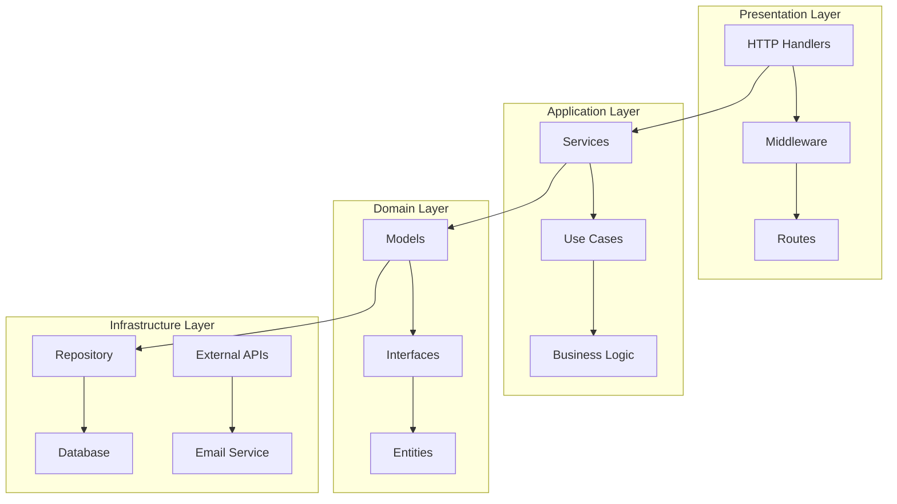
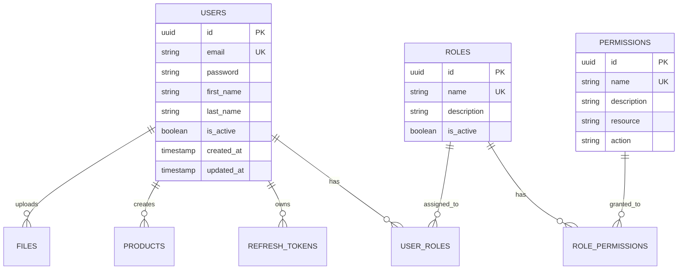
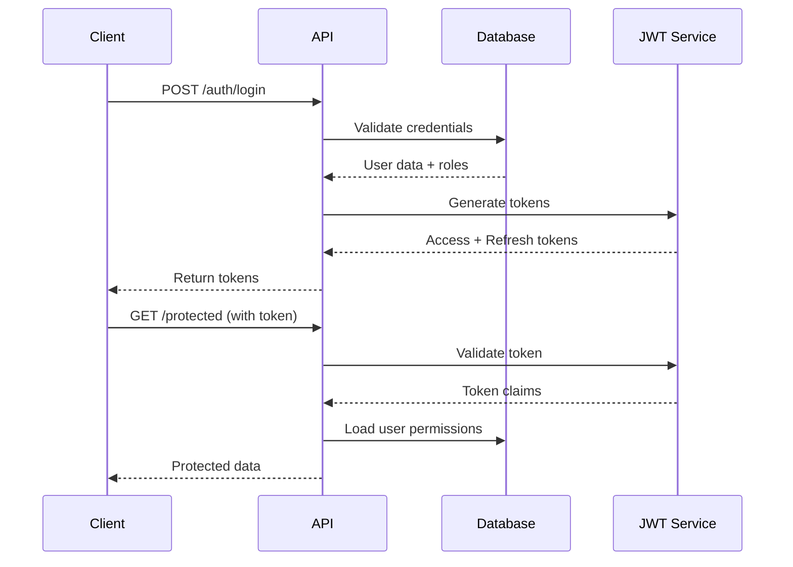

# 🚀 Base Golang RESTful API with Authentication

Một dự án RESTful API hoàn chỉnh được xây dựng bằng Go, Gin framework, với hệ thống xác thực JWT và phân quyền RBAC (Role-Based Access Control).

## 📋 Mục lục

1. [Giới thiệu về Golang](#1-giới-thiệu-về-golang)
2. [Giới thiệu về dự án](#2-giới-thiệu-về-dự-án)
3. [Tại sao chọn Go? So sánh với các ngôn ngữ khác](#3-tại-sao-chọn-go-so-sánh-với-các-ngôn-ngữ-khác)
4. [Tổng quan về kiến trúc dự án](#4-tổng-quan-về-kiến-trúc-dự-án)
5. [Hướng dẫn cài đặt và chạy](#5-hướng-dẫn-cài-đặt-và-chạy)
6. [Các giai đoạn thực hành Golang](#6-các-giai-đoạn-thực-hành-golang)

---

## 1. Giới thiệu về Golang

**Go** (hay còn gọi là **Golang**) là một ngôn ngữ lập trình được phát triển bởi Google vào năm 2009. Go được thiết kế để giải quyết các vấn đề phức tạp trong việc phát triển phần mềm hiện đại.

### 🎯 Đặc điểm nổi bật của Go:

- **Hiệu suất cao**: Compile sang machine code, chạy nhanh như C/C++
- **Concurrency mạnh mẽ**: Goroutines và channels giúp xử lý đồng thời dễ dàng
- **Đơn giản và dễ học**: Syntax gọn gàng, ít từ khóa
- **Memory management tự động**: Garbage collector thông minh
- **Cross-platform**: Chạy được trên nhiều hệ điều hành
- **Static typing**: Phát hiện lỗi tại compile time
- **Built-in testing**: Framework test tích hợp sẵn

### 💡 Tại sao Go phù hợp cho Backend API?

```go
// Ví dụ: Xử lý HTTP request đơn giản
func handler(c *gin.Context) {
    c.JSON(200, gin.H{
        "message": "Hello from Go!",
        "timestamp": time.Now(),
    })
}
```

---

## 2. Giới thiệu về dự án

**Base Golang RESTful API** là một dự án template hoàn chỉnh cho việc phát triển các ứng dụng web API sử dụng Go. Dự án bao gồm:

### ✨ Tính năng chính:

- 🔐 **JWT Authentication** - Xác thực người dùng với Access Token & Refresh Token
- 🛡️ **RBAC Authorization** - Phân quyền dựa trên vai trò (Role-Based Access Control)
- 📊 **RESTful API** - Thiết kế API theo chuẩn REST
- 🗄️ **Database Integration** - Tích hợp PostgreSQL với GORM
- 📧 **Email Service** - Gửi email với template
- 📁 **File Upload** - Upload và quản lý file
- 📚 **Swagger Documentation** - Tài liệu API tự động
- 🧪 **Testing Suite** - Unit tests và Integration tests
- 🌐 **Internationalization** - Hỗ trợ đa ngôn ngữ
- 📈 **Monitoring** - Health check và metrics

### 🏗️ Cấu trúc dự án:

```
base-gin/
├── cmd/server/          # Entry point
├── internal/
│   ├── app/            # Application layer
│   │   ├── handlers/   # HTTP handlers
│   │   ├── middleware/ # Middleware functions
│   │   ├── routes/     # Route definitions
│   │   └── observers/  # Observer pattern
│   ├── domain/         # Domain layer
│   │   ├── models/     # Data models
│   │   ├── repository/ # Data access
│   │   └── services/   # Business logic
│   └── pkg/           # Shared packages
│       ├── auth/      # Authentication
│       ├── config/    # Configuration
│       ├── database/  # Database utilities
│       └── utils/     # Utility functions
├── test/              # Test files
├── docs/              # Swagger documentation
└── configs/           # Configuration files
```

---

## 3. Tại sao chọn Go? So sánh với các ngôn ngữ khác

### 🆚 Go vs Các ngôn ngữ khác:

| Tiêu chí | Go | Node.js | Python | Java | C# |
|----------|----|---------|---------|------|-----|
| **Performance** | ⭐⭐⭐⭐⭐ | ⭐⭐⭐ | ⭐⭐ | ⭐⭐⭐⭐ | ⭐⭐⭐⭐ |
| **Concurrency** | ⭐⭐⭐⭐⭐ | ⭐⭐⭐ | ⭐⭐ | ⭐⭐⭐ | ⭐⭐⭐ |
| **Memory Usage** | ⭐⭐⭐⭐⭐ | ⭐⭐ | ⭐⭐ | ⭐⭐ | ⭐⭐ |
| **Learning Curve** | ⭐⭐⭐⭐ | ⭐⭐⭐⭐⭐ | ⭐⭐⭐⭐⭐ | ⭐⭐ | ⭐⭐⭐ |
| **Ecosystem** | ⭐⭐⭐⭐ | ⭐⭐⭐⭐⭐ | ⭐⭐⭐⭐⭐ | ⭐⭐⭐⭐⭐ | ⭐⭐⭐⭐ |
| **Deployment** | ⭐⭐⭐⭐⭐ | ⭐⭐⭐ | ⭐⭐ | ⭐⭐ | ⭐⭐ |

### 🚀 Ví dụ so sánh hiệu suất:

#### **Go - Concurrent HTTP Handler:**
```go
func handleRequests(requests <-chan *http.Request) {
    for req := range requests {
        go func(r *http.Request) {
            // Xử lý request đồng thời
            processRequest(r)
        }(req)
    }
}
```

#### **Node.js - Async/Await:**
```javascript
async function handleRequests(requests) {
    for (const req of requests) {
        setImmediate(async () => {
            await processRequest(req);
        });
    }
}
```

#### **Python - Threading:**
```python
import threading

def handle_requests(requests):
    for req in requests:
        thread = threading.Thread(target=process_request, args=(req,))
        thread.start()
```

### 💪 Ưu điểm của Go:

1. **Goroutines**: Xử lý hàng triệu goroutines với chi phí thấp
2. **Compilation**: Compile nhanh, binary nhỏ gọn
3. **Garbage Collection**: GC tối ưu, pause time ngắn
4. **Standard Library**: Thư viện chuẩn phong phú
5. **Tooling**: Công cụ phát triển mạnh mẽ

### ⚠️ Nhược điểm của Go:

1. **Generics**: Hỗ trợ generics muộn (Go 1.18+)
2. **Error Handling**: Có thể verbose với error handling
3. **Dependency Management**: Module system phức tạp
4. **Learning Resources**: Ít tài liệu tiếng Việt

---

## 4. Tổng quan về kiến trúc dự án

### 🏛️ Kiến trúc Clean Architecture

Dự án sử dụng **Clean Architecture** với các layer rõ ràng:



### 🔧 Design Patterns được sử dụng:

#### 1. **Repository Pattern**
```go
type UserRepository interface {
    Create(user *User) error
    GetByID(id uuid.UUID) (*User, error)
    Update(user *User) error
    Delete(id uuid.UUID) error
}
```

#### 2. **Service Layer Pattern**
```go
type UserService struct {
    repo UserRepository
}

func (s *UserService) CreateUser(req CreateUserRequest) (*User, error) {
    // Business logic here
    return s.repo.Create(user)
}
```

#### 3. **Observer Pattern**
```go
type Observer interface {
    Notify(event Event)
}

type EmailChannel struct{}
func (e *EmailChannel) Notify(event Event) {
    // Send email notification
}
```

#### 4. **Middleware Pattern**
```go
func AuthMiddleware() gin.HandlerFunc {
    return func(c *gin.Context) {
        // Authentication logic
        c.Next()
    }
}
```

### 🗄️ Database Schema



### 🔐 Authentication & Authorization Flow



---

## 5. Hướng dẫn cài đặt và chạy

### 📋 Yêu cầu hệ thống:

- **Go**: 1.24.0 hoặc cao hơn
- **PostgreSQL**: 12.0 hoặc cao hơn
- **Git**: Để clone repository
- **Air**: Hot reload tool cho Go development
- **Swag**: Swagger documentation generator

### 🛠️ Cài đặt Go:

#### **macOS (Homebrew):**
```bash
brew install go
```

#### **Ubuntu/Debian:**
```bash
sudo apt update
sudo apt install golang-go
```

#### **Windows:**
Tải từ [golang.org](https://golang.org/dl/) và cài đặt

### 🔥 Cài đặt Air (Hot Reload):

#### **macOS (Homebrew):**
```bash
brew install air
```

#### **Linux/Windows:**
```bash
go install github.com/cosmtrek/air@latest
```

#### **Hoặc sử dụng Go:**
```bash
go install github.com/cosmtrek/air@latest
```

### 📚 Cài đặt Swag (Swagger Generator):

```bash
go install github.com/swaggo/swag/cmd/swag@latest
```

### 🛠️ Cài đặt các tools khác (tùy chọn):

#### **GolangCI-Lint (Code Quality):**
```bash
# macOS
brew install golangci-lint

# Linux/Windows
curl -sSfL https://raw.githubusercontent.com/golangci/golangci-lint/master/install.sh | sh -s -- -b $(go env GOPATH)/bin v1.54.2
```

#### **Mockgen (Mock Generation):**
```bash
go install github.com/golang/mock/mockgen@latest
```

#### **Gosec (Security Scanner):**
```bash
go install github.com/securecodewarrior/gosec/v2/cmd/gosec@latest
```

### 🔧 Giải thích về các tools:

#### **🔥 Air - Hot Reload Tool:**
- **Mục đích**: Tự động restart server khi có thay đổi code
- **Lợi ích**: Tiết kiệm thời gian development, không cần restart thủ công
- **Cấu hình**: File `.air.toml` đã được cấu hình sẵn
- **Sử dụng**: Chỉ cần chạy `air` hoặc `make dev`

#### **📚 Swag - Swagger Generator:**
- **Mục đích**: Tự động generate Swagger documentation từ code comments
- **Lợi ích**: API documentation luôn được cập nhật
- **Sử dụng**: Chạy `swag init` trước khi start server

#### **🛠️ GolangCI-Lint:**
- **Mục đích**: Code quality và style checking
- **Lợi ích**: Đảm bảo code quality, phát hiện lỗi sớm
- **Sử dụng**: `golangci-lint run`

#### **🎭 Mockgen:**
- **Mục đích**: Generate mock objects cho testing
- **Lợi ích**: Dễ dàng tạo unit tests với mock dependencies
- **Sử dụng**: `mockgen -source=interface.go -destination=mock.go`

#### **🔒 Gosec:**
- **Mục đích**: Security vulnerability scanning
- **Lợi ích**: Phát hiện các lỗ hổng bảo mật trong code
- **Sử dụng**: `gosec ./...`

### 🗄️ Cài đặt PostgreSQL:

#### **macOS (Homebrew):**
```bash
brew install postgresql
brew services start postgresql
```

#### **Ubuntu/Debian:**
```bash
sudo apt install postgresql postgresql-contrib
sudo systemctl start postgresql
```

#### **Docker (Khuyến nghị):**
```bash
docker run --name postgres-db \
  -e POSTGRES_DB=base_gin \
  -e POSTGRES_USER=admin \
  -e POSTGRES_PASSWORD=password \
  -p 5432:5432 \
  -d postgres:15
```

### 🚀 Chạy dự án:

#### **1. Clone repository:**
```bash
git clone <repository-url>
cd base-gin
```

#### **2. Cài đặt dependencies:**
```bash
go mod download
go mod tidy
```

#### **3. Tạo file cấu hình:**
```bash
mkdir -p configs
cat > configs/.env << EOF
# Server Configuration
SERVER_HOST=localhost
SERVER_PORT=8001
SERVER_READ_TIMEOUT=30
SERVER_WRITE_TIMEOUT=30

# Database Configuration
DB_HOST=localhost
DB_PORT=5432
DB_USER=admin
DB_PASSWORD=password
DB_NAME=base_gin
DB_SSLMODE=disable
DB_TIMEZONE=UTC

# JWT Configuration
JWT_SECRET_KEY=your-super-secret-key-here
JWT_ACCESS_TOKEN_DURATION=15m
JWT_REFRESH_TOKEN_DURATION=168h

# Email Configuration
EMAIL_HOST=smtp.gmail.com
EMAIL_PORT=587
EMAIL_USERNAME=your-email@gmail.com
EMAIL_PASSWORD=your-app-password
EMAIL_FROM=your-email@gmail.com
EOF
```

#### **4. Chạy dự án:**

##### **🔥 Development với Air (Khuyến nghị):**
```bash
# Cách 1: Sử dụng Air trực tiếp
air

# Cách 2: Sử dụng Makefile
make dev

# Cách 3: Chạy với custom config
air -c .air.toml
```

##### **🚀 Production:**
```bash
# Cách 1: Sử dụng Makefile
make run

# Cách 2: Chạy trực tiếp
go run cmd/server/main.go

# Cách 3: Build và chạy
make build
./base-gin
```

##### **📚 Generate Swagger Documentation:**
```bash
# Generate docs trước khi chạy
swag init -g cmd/server/main.go --parseDependency --parseInternal

# Hoặc sử dụng Makefile
make docs
```

### 🔄 Development Workflow với Air:

#### **Workflow khuyến nghị:**
1. **Setup lần đầu:**
   ```bash
   # Cài đặt dependencies
   go mod download
   
   # Generate Swagger docs
   make docs
   
   # Chạy với Air
   make dev
   ```

2. **Development hàng ngày:**
   ```bash
   # Chỉ cần chạy Air
   air
   
   # Hoặc với Makefile
   make dev
   ```

3. **Khi thay đổi API:**
   ```bash
   # Generate lại Swagger docs
   make docs
   
   # Air sẽ tự động restart
   ```

#### **Tính năng của Air:**
- ✅ **Auto-reload**: Tự động restart khi file `.go` thay đổi
- ✅ **Fast build**: Chỉ build lại khi cần thiết
- ✅ **Error handling**: Hiển thị lỗi compile rõ ràng
- ✅ **Custom config**: Cấu hình linh hoạt qua `.air.toml`
- ✅ **Exclude directories**: Bỏ qua thư mục không cần thiết

#### **5. Kiểm tra API:**
```bash
# Health check
curl http://localhost:8001/health

# Swagger documentation
open http://localhost:8001/swagger/index.html
```

### 🧪 Chạy tests:

```bash
# Chạy tất cả tests
make test

# Chạy unit tests
make test-unit

# Chạy integration tests
make test-integration

# Chạy tests với coverage
make test-coverage
```

### 🐳 Chạy với Docker:

```bash
# Build Docker image
make docker-build

# Chạy container
make docker-run
```

### 🔧 Troubleshooting Air:

#### **Lỗi thường gặp:**

1. **Air không tìm thấy:**
   ```bash
   # Kiểm tra PATH
   echo $PATH
   
   # Cài đặt lại Air
   go install github.com/cosmtrek/air@latest
   
   # Thêm vào PATH nếu cần
   export PATH=$PATH:$(go env GOPATH)/bin
   ```

2. **Air không restart:**
   ```bash
   # Kiểm tra file .air.toml
   cat .air.toml
   
   # Chạy với verbose mode
   air -v
   
   # Force restart
   air -s
   ```

3. **Build errors:**
   ```bash
   # Kiểm tra Go version
   go version
   
   # Clean và rebuild
   make clean
   go mod tidy
   air
   ```

4. **Port đã được sử dụng:**
   ```bash
   # Kiểm tra port
   lsof -i :8001
   
   # Kill process
   kill -9 <PID>
   
   # Hoặc thay đổi port trong config
   ```

---

## 6. Các giai đoạn thực hành Golang

### 🎯 **Giai đoạn 1: Cơ bản (2-3 tuần)**

#### **Tuần 1: Syntax cơ bản**
- [ ] Variables, constants, data types
- [ ] Functions, methods, receivers
- [ ] Control structures (if, for, switch)
- [ ] Arrays, slices, maps
- [ ] Structs và interfaces

#### **Tuần 2: Concurrency**
- [ ] Goroutines
- [ ] Channels
- [ ] Select statement
- [ ] Sync package
- [ ] Context package

#### **Tuần 3: Error Handling & Testing**
- [ ] Error handling patterns
- [ ] Panic và recover
- [ ] Unit testing
- [ ] Benchmarking
- [ ] Mocking

### 🚀 **Giai đoạn 2: Web Development (3-4 tuần)**

#### **Tuần 4: HTTP & Web Servers**
- [ ] net/http package
- [ ] HTTP handlers
- [ ] Middleware
- [ ] Routing
- [ ] Request/Response handling

#### **Tuần 5: Gin Framework**
- [ ] Gin basics
- [ ] Middleware trong Gin
- [ ] Route groups
- [ ] Binding và validation
- [ ] Error handling

#### **Tuần 6: Database Integration**
- [ ] GORM basics
- [ ] Database connections
- [ ] Migrations
- [ ] CRUD operations
- [ ] Relationships

#### **Tuần 7: Authentication & Security**
- [ ] JWT implementation
- [ ] Password hashing
- [ ] Middleware authentication
- [ ] CORS handling
- [ ] Input validation

### 🏗️ **Giai đoạn 3: Architecture & Patterns (4-5 tuần)**

#### **Tuần 8-9: Clean Architecture**
- [ ] Repository pattern
- [ ] Service layer
- [ ] Dependency injection
- [ ] Interface segregation
- [ ] Domain modeling

#### **Tuần 10-11: Advanced Patterns**
- [ ] Observer pattern
- [ ] Factory pattern
- [ ] Builder pattern
- [ ] Strategy pattern
- [ ] Command pattern

#### **Tuần 12: Testing & Quality**
- [ ] Integration testing
- [ ] Test coverage
- [ ] Code quality tools
- [ ] Performance testing
- [ ] Security testing

### 🚀 **Giai đoạn 4: Production Ready (3-4 tuần)**

#### **Tuần 13-14: DevOps & Deployment**
- [ ] Docker containerization
- [ ] CI/CD pipelines
- [ ] Environment configuration
- [ ] Logging và monitoring
- [ ] Health checks

#### **Tuần 15-16: Advanced Topics**
- [ ] Microservices
- [ ] Message queues
- [ ] Caching strategies
- [ ] API versioning
- [ ] Documentation

### 📚 **Tài liệu học tập khuyến nghị:**

1. **Sách:**
   - "The Go Programming Language" - Alan Donovan
   - "Effective Go" - Official Go documentation
   - "Go in Action" - Manning Publications

2. **Online Resources:**
   - [Go by Example](https://gobyexample.com/)
   - [Go Tour](https://tour.golang.org/)
   - [Go Playground](https://play.golang.org/)

3. **Practice Projects:**
   - REST API với Gin
   - CLI tools
   - Web scrapers
   - Microservices
   - Chat applications

### 🎯 **Mục tiêu sau mỗi giai đoạn:**

- **Giai đoạn 1**: Viết được chương trình Go cơ bản
- **Giai đoạn 2**: Xây dựng được web API đơn giản
- **Giai đoạn 3**: Thiết kế được kiến trúc ứng dụng phức tạp
- **Giai đoạn 4**: Triển khai được ứng dụng production-ready

---

## 🤝 Đóng góp

Mọi đóng góp đều được chào đón! Vui lòng:

1. Fork repository
2. Tạo feature branch
3. Commit changes
4. Push to branch
5. Tạo Pull Request

## 📄 License

Dự án này được phân phối dưới MIT License. Xem file `LICENSE` để biết thêm chi tiết.

## 📞 Hỗ trợ

Nếu có câu hỏi hoặc cần hỗ trợ:

- 📧 Email: support@example.com
- 🐛 Issues: [GitHub Issues](https://github.com/your-repo/issues)
- 📚 Documentation: [Swagger UI](http://localhost:8001/swagger/index.html)

---

**Chúc bạn coding vui vẻ với Go! 🚀**
