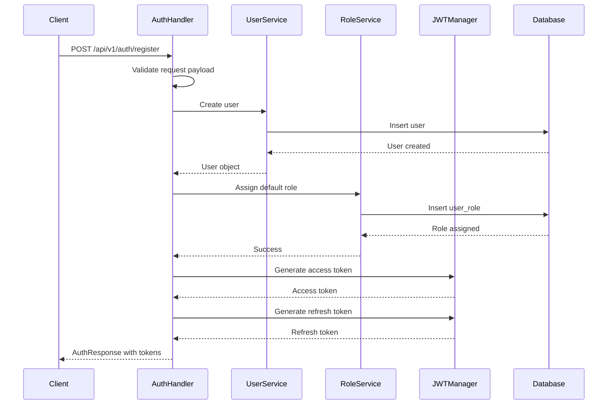

# Phase 1: JWT + RBAC Implementation

## 📋 Mục lục

1. [Giới thiệu về JWT và RBAC](#1-giới-thiệu-về-jwt-và-rbac)
2. [Cấu trúc file để triển khai](#2-cấu-trúc-file-để-triển-khai)
3. [Cách viết code trong Go (Gin Framework)](#3-cách-viết-code-trong-go-gin-framework)
4. [Ví dụ luồng code chi tiết - API đăng ký](#4-ví-dụ-luồng-code-chi-tiết---api-đăng-ký)

---

## 1. Giới thiệu về JWT và RBAC

### 🔐 **JWT (JSON Web Token)**

**JWT** là một chuẩn mở (RFC 7519) định nghĩa cách truyền thông tin một cách an toàn giữa các bên dưới dạng JSON object.

#### **Cấu trúc JWT:**
```
header.payload.signature
```

#### **Ví dụ JWT:**
```
eyJhbGciOiJIUzI1NiIsInR5cCI6IkpXVCJ9.eyJ1c2VyX2lkIjoiMTIzNDU2Nzg5MCIsImVtYWlsIjoidXNlckBleGFtcGxlLmNvbSIsInRva2VuX3R5cGUiOiJhY2Nlc3MifQ.signature
```

#### **Ưu điểm của JWT:**
- ✅ **Stateless**: Không cần lưu trữ session trên server
- ✅ **Scalable**: Dễ dàng scale horizontal
- ✅ **Cross-domain**: Có thể sử dụng qua nhiều domain
- ✅ **Self-contained**: Chứa tất cả thông tin cần thiết
- ✅ **Secure**: Được ký số để đảm bảo tính toàn vẹn

### 🛡️ **RBAC (Role-Based Access Control)**

**RBAC** là mô hình phân quyền dựa trên vai trò, cho phép quản lý quyền truy cập thông qua việc gán vai trò cho người dùng.

#### **Các thành phần chính:**
- **User**: Người dùng
- **Role**: Vai trò (admin, user, moderator)
- **Permission**: Quyền hạn (create, read, update, delete)
- **Resource**: Tài nguyên (user, product, order)

#### **Mối quan hệ:**
```
User → Role → Permission → Resource
```

#### **Ví dụ RBAC:**
```
User "john" có Role "admin" → có Permission "user.delete" → có thể xóa User
User "jane" có Role "user" → có Permission "user.read" → chỉ có thể đọc User
```

---

## 2. Cấu trúc file để triển khai

### 📁 **Cấu trúc thư mục dự án:**

```
base-gin/
├── internal/
│   ├── pkg/auth/              # JWT implementation
│   │   ├── jwt.go            # JWT manager và logic
│   │   └── password.go       # Password hashing
│   ├── app/middleware/        # Middleware
│   │   ├── auth.go           # Authentication middleware
│   │   └── rbac.go           # RBAC middleware
│   ├── app/handlers/         # HTTP handlers
│   │   └── auth_handler.go   # Auth endpoints
│   ├── domain/models/        # Data models
│   │   ├── auth.go           # Auth request/response models
│   │   ├── user.go           # User model
│   │   ├── role.go           # Role model
│   │   └── permission.go     # Permission model
│   ├── domain/services/      # Business logic
│   │   ├── user_service.go   # User business logic
│   │   └── role_service.go   # Role business logic
│   └── domain/repository/    # Data access
│       ├── user_repository.go
│       └── role_repository.go
```

### 🔧 **Các file chính cần tạo:**

#### **1. JWT Manager (`internal/pkg/auth/jwt.go`)**
```go
type JWTManager struct {
    secretKey            string
    accessTokenDuration  time.Duration
    refreshTokenDuration time.Duration
    issuer               string
}

type JWTClaims struct {
    UserID    uuid.UUID `json:"user_id"`
    Email     string    `json:"email"`
    TokenType TokenType `json:"token_type"`
    jwt.RegisteredClaims
}
```

#### **2. Auth Middleware (`internal/app/middleware/auth.go`)**
```go
type AuthMiddleware struct {
    jwtManager  *auth.JWTManager
    userService *services.UserService
}

func (m *AuthMiddleware) Authenticate() gin.HandlerFunc
func (m *AuthMiddleware) OptionalAuthenticate() gin.HandlerFunc
```

#### **3. RBAC Middleware (`internal/app/middleware/rbac.go`)**
```go
func RequireRole(roleName string) gin.HandlerFunc
func RequirePermission(permissionName string) gin.HandlerFunc
func RequireAnyRole(roleNames []string) gin.HandlerFunc
```

#### **4. Auth Handler (`internal/app/handlers/auth_handler.go`)**
```go
type AuthHandler struct {
    userService UserServiceInterface
    roleService RoleServiceInterface
    jwtManager  JWTManagerInterface
}

func (h *AuthHandler) Register(c *gin.Context)
func (h *AuthHandler) Login(c *gin.Context)
func (h *AuthHandler) RefreshToken(c *gin.Context)
```

#### **5. Models (`internal/domain/models/`)**
```go
// Auth models
type LoginRequest struct
type RegisterRequest struct
type AuthResponse struct

// User model
type User struct {
    ID       uuid.UUID `gorm:"type:uuid;primary_key"`
    Email    string    `gorm:"uniqueIndex"`
    Password string
    Roles    []Role    `gorm:"many2many:user_roles;"`
}

// Role model
type Role struct {
    ID          uuid.UUID     `gorm:"type:uuid;primary_key"`
    Name        string        `gorm:"uniqueIndex"`
    Permissions []Permission  `gorm:"many2many:role_permissions;"`
}
```

---

## 3. Cách viết code trong Go (Gin Framework)

### 🔧 **1. JWT Implementation**

#### **Tạo JWT Manager:**
```go
// internal/pkg/auth/jwt.go
package auth

import (
    "errors"
    "time"
    "github.com/golang-jwt/jwt/v5"
    "github.com/google/uuid"
)

// JWTManager quản lý việc tạo và validate JWT tokens
type JWTManager struct {
    secretKey            string        // Secret key để ký token
    accessTokenDuration  time.Duration // Thời gian sống của access token
    refreshTokenDuration time.Duration // Thời gian sống của refresh token
    issuer               string        // Tên issuer (thường là tên ứng dụng)
}

// NewJWTManager tạo một instance mới của JWTManager
func NewJWTManager(config JWTConfig) *JWTManager {
    return &JWTManager{
        secretKey:            config.SecretKey,
        accessTokenDuration:  config.AccessTokenDuration,
        refreshTokenDuration: config.RefreshTokenDuration,
        issuer:               config.Issuer,
    }
}

// GenerateAccessToken tạo access token cho user
func (m *JWTManager) GenerateAccessToken(userID uuid.UUID, email string) (string, error) {
    return m.generateToken(userID, email, AccessToken, m.accessTokenDuration)
}

// generateToken là method private để tạo token với các tham số cụ thể
func (m *JWTManager) generateToken(userID uuid.UUID, email string, tokenType TokenType, duration time.Duration) (string, error) {
    now := time.Now()
    
    // Tạo JWT claims chứa thông tin user và metadata
    claims := JWTClaims{
        UserID:    userID,    // ID của user
        Email:     email,     // Email của user
        TokenType: tokenType, // Loại token (access hoặc refresh)
        RegisteredClaims: jwt.RegisteredClaims{
            ExpiresAt: jwt.NewNumericDate(now.Add(duration)), // Thời gian hết hạn
            IssuedAt:  jwt.NewNumericDate(now),               // Thời gian tạo
            NotBefore: jwt.NewNumericDate(now),               // Thời gian có hiệu lực
            Issuer:    m.issuer,                              // Người phát hành token
            Subject:   userID.String(),                       // Chủ thể của token
            ID:        uuid.New().String(),                   // ID duy nhất của token
        },
    }

    // Tạo token với thuật toán HS256 và ký bằng secret key
    token := jwt.NewWithClaims(jwt.SigningMethodHS256, claims)
    return token.SignedString([]byte(m.secretKey))
}
```

**Giải thích chi tiết:**

- **JWTManager struct**: Lưu trữ cấu hình cần thiết để tạo và validate JWT tokens
- **secretKey**: Khóa bí mật để ký và verify token, phải được bảo mật tuyệt đối
- **accessTokenDuration**: Thời gian sống ngắn (15 phút) để bảo mật cao
- **refreshTokenDuration**: Thời gian sống dài (7 ngày) để refresh access token
- **JWTClaims**: Chứa thông tin user và metadata theo chuẩn JWT
- **RegisteredClaims**: Các claims chuẩn của JWT (exp, iat, nbf, iss, sub, jti)
- **SigningMethodHS256**: Thuật toán HMAC SHA-256 để ký token

### 🛡️ **2. Authentication Middleware**

#### **Tạo Auth Middleware:**
```go
// internal/app/middleware/auth.go
package middleware

import (
    "base-gin/internal/domain/services"
    "base-gin/internal/pkg/auth"
    "github.com/gin-gonic/gin"
)

// AuthMiddleware xử lý authentication cho các request
type AuthMiddleware struct {
    jwtManager  *auth.JWTManager  // Quản lý JWT tokens
    userService *services.UserService // Service để lấy thông tin user
}

// Authenticate tạo middleware function để xác thực user
func (m *AuthMiddleware) Authenticate() gin.HandlerFunc {
    return func(c *gin.Context) {
        // 1. Extract token từ request header
        token := extractToken(c)
        if token == "" {
            c.JSON(401, gin.H{"error": "Token required"})
            c.Abort() // Dừng xử lý request
            return
        }

        // 2. Validate token và lấy claims
        claims, err := m.jwtManager.ValidateToken(token, auth.AccessToken)
        if err != nil {
            c.JSON(401, gin.H{"error": "Invalid token"})
            c.Abort()
            return
        }

        // 3. Lưu thông tin user vào context để sử dụng trong handlers
        c.Set("user_id", claims.UserID.String())     // ID của user
        c.Set("user_email", claims.Email)            // Email của user
        c.Set("token_claims", claims)                // Toàn bộ claims

        // 4. Load user với roles để sử dụng cho RBAC
        user, err := m.userService.GetByIDWithRoles(claims.UserID.String())
        if err == nil && user != nil {
            c.Set("user", user) // Lưu user object vào context
        }

        c.Next() // Tiếp tục xử lý request
    }
}

// extractToken lấy token từ Authorization header
func extractToken(c *gin.Context) string {
    bearerToken := c.GetHeader("Authorization")
    if bearerToken != "" {
        // Parse "Bearer <token>" format
        parts := strings.SplitN(bearerToken, " ", 2)
        if len(parts) == 2 && strings.ToLower(parts[0]) == "bearer" {
            return parts[1] // Trả về token (phần thứ 2)
        }
    }
    return "" // Không tìm thấy token
}
```

**Giải thích chi tiết:**

- **AuthMiddleware struct**: Chứa dependencies cần thiết để xác thực
- **Authenticate()**: Trả về Gin handler function để xử lý authentication
- **extractToken()**: Lấy JWT token từ Authorization header theo format "Bearer <token>"
- **c.Set()**: Lưu thông tin vào Gin context để sử dụng trong các handler tiếp theo
- **c.Abort()**: Dừng xử lý request và không gọi các middleware/handler tiếp theo
- **c.Next()**: Tiếp tục xử lý request với middleware/handler tiếp theo
- **GetByIDWithRoles()**: Load user kèm roles để sử dụng cho RBAC

### 🔒 **3. RBAC Middleware**

#### **Tạo RBAC Middleware:**
```go
// internal/app/middleware/rbac.go
package middleware

import (
    "net/http"
    "github.com/gin-gonic/gin"
)

// RequireRole kiểm tra user có role cụ thể không
func RequireRole(roleName string) gin.HandlerFunc {
    return func(c *gin.Context) {
        // 1. Lấy user từ context (đã được set bởi AuthMiddleware)
        user, exists := c.Get("user")
        if !exists || user == nil {
            c.JSON(http.StatusUnauthorized, gin.H{
                "error": "Authentication required",
            })
            c.Abort()
            return
        }

        // 2. Type assertion để kiểm tra user có method HasRole không
        userWithRoles, ok := user.(interface{ HasRole(string) bool })
        if !ok {
            c.JSON(http.StatusForbidden, gin.H{
                "error": "Invalid user type",
            })
            c.Abort()
            return
        }

        // 3. Kiểm tra user có role cần thiết không
        if !userWithRoles.HasRole(roleName) {
            c.JSON(http.StatusForbidden, gin.H{
                "error": "Insufficient permissions",
            })
            c.Abort()
            return
        }

        c.Next() // User có quyền, tiếp tục xử lý
    }
}

// RequirePermission kiểm tra user có permission cụ thể không
func RequirePermission(permissionName string) gin.HandlerFunc {
    return func(c *gin.Context) {
        // 1. Lấy user từ context
        user, exists := c.Get("user")
        if !exists || user == nil {
            c.JSON(http.StatusUnauthorized, gin.H{
                "error": "Authentication required",
            })
            c.Abort()
            return
        }

        // 2. Type assertion để kiểm tra user có method HasPermission không
        userWithPerms, ok := user.(interface{ HasPermission(string) bool })
        if !ok {
            c.JSON(http.StatusForbidden, gin.H{
                "error": "Invalid user type",
            })
            c.Abort()
            return
        }

        // 3. Kiểm tra user có permission cần thiết không
        if !userWithPerms.HasPermission(permissionName) {
            c.JSON(http.StatusForbidden, gin.H{
                "error": "Insufficient permissions",
            })
            c.Abort()
            return
        }

        c.Next() // User có quyền, tiếp tục xử lý
    }
}
```

**Giải thích chi tiết:**

- **RequireRole()**: Middleware kiểm tra user có role cụ thể (admin, user, moderator)
- **RequirePermission()**: Middleware kiểm tra user có permission cụ thể (user.create, user.delete)
- **c.Get("user")**: Lấy user object từ Gin context (đã được set bởi AuthMiddleware)
- **Type assertion**: Chuyển đổi interface{} thành interface có method cần thiết
- **HasRole()**: Method kiểm tra user có role cụ thể không
- **HasPermission()**: Method kiểm tra user có permission cụ thể không
- **HTTP Status Codes**: 401 (Unauthorized) cho chưa đăng nhập, 403 (Forbidden) cho không có quyền

### 🎯 **4. Auth Handler**

#### **Tạo Auth Handler:**
```go
// internal/app/handlers/auth_handler.go
package handlers

import (
    "base-gin/internal/domain/models"
    "base-gin/internal/pkg/auth"
    "net/http"
    "github.com/gin-gonic/gin"
    "github.com/google/uuid"
)

// AuthHandler xử lý các request liên quan đến authentication
type AuthHandler struct {
    userService UserServiceInterface  // Interface để tương tác với user
    roleService RoleServiceInterface  // Interface để tương tác với role
    jwtManager  JWTManagerInterface   // Interface để quản lý JWT
}

// Register xử lý đăng ký user mới
func (h *AuthHandler) Register(c *gin.Context) {
    // 1. Parse và validate request body
    var req models.RegisterRequest
    if err := c.ShouldBindJSON(&req); err != nil {
        c.JSON(http.StatusBadRequest, models.ErrorResponse{
            Error:   "validation_error",
            Message: "Invalid request payload",
        })
        return
    }

    // 2. Tạo UserCreateRequest từ RegisterRequest
    userReq := models.UserCreateRequest{
        Email:     req.Email,     // Email từ request
        Password:  req.Password,  // Password từ request
        FirstName: req.FirstName, // First name từ request
        LastName:  req.LastName,  // Last name từ request
    }

    // 3. Gọi UserService để tạo user
    user, err := h.userService.Create(userReq)
    if err != nil {
        c.JSON(http.StatusBadRequest, models.ErrorResponse{
            Error:   "registration_failed",
            Message: err.Error(),
        })
        return
    }

    // 4. Gán role mặc định "user" cho user mới
    if err := h.roleService.AssignDefaultRole(user.ID); err != nil {
        // Log error nhưng không fail registration
        // User được tạo nhưng chưa có role - admin có thể gán sau
    }

    // 5. Generate access token
    accessToken, err := h.jwtManager.GenerateAccessToken(user.ID, user.Email)
    if err != nil {
        c.JSON(http.StatusInternalServerError, models.ErrorResponse{
            Error:   "token_generation_failed",
            Message: "Failed to generate tokens",
        })
        return
    }

    // 6. Generate refresh token
    refreshToken, err := h.jwtManager.GenerateRefreshToken(user.ID, user.Email)
    if err != nil {
        c.JSON(http.StatusInternalServerError, models.ErrorResponse{
            Error:   "token_generation_failed",
            Message: "Failed to generate tokens",
        })
        return
    }

    // 7. Tạo response với thông tin user và tokens
    response := models.AuthResponse{
        User:         user.ToResponse(),                    // Thông tin user
        AccessToken:  accessToken,                          // Access token
        RefreshToken: refreshToken,                         // Refresh token
        TokenType:    "Bearer",                             // Loại token
        ExpiresIn:    int64(h.jwtManager.GetTokenDuration(auth.AccessToken).Seconds()), // Thời gian hết hạn
    }

    // 8. Trả về response với status 201 (Created)
    c.JSON(http.StatusCreated, response)
}
```

**Giải thích chi tiết:**

- **AuthHandler struct**: Chứa các dependencies cần thiết để xử lý authentication
- **Register()**: Handler function xử lý đăng ký user mới
- **c.ShouldBindJSON()**: Parse JSON request body vào struct
- **UserService.Create()**: Tạo user mới trong database
- **RoleService.AssignDefaultRole()**: Gán role mặc định cho user
- **JWTManager.GenerateAccessToken()**: Tạo access token
- **JWTManager.GenerateRefreshToken()**: Tạo refresh token
- **user.ToResponse()**: Chuyển đổi user model thành response format
- **c.JSON()**: Trả về JSON response với HTTP status code

### 🗄️ **5. Models**

#### **User Model với RBAC:**
```go
// internal/domain/models/user.go
package models

import (
    "time"
    "github.com/google/uuid"
    "gorm.io/gorm"
)

// User model đại diện cho user trong hệ thống
type User struct {
    ID        uuid.UUID      `gorm:"type:uuid;primary_key" json:"id"`                    // UUID primary key
    Email     string         `gorm:"type:varchar(255);uniqueIndex;not null" json:"email"` // Email duy nhất
    Password  string         `gorm:"type:varchar(255);not null" json:"-"`                // Password (không trả về JSON)
    FirstName string         `gorm:"type:varchar(100)" json:"first_name"`                // Tên
    LastName  string         `gorm:"type:varchar(100)" json:"last_name"`                 // Họ
    IsActive  bool           `gorm:"default:true;not null" json:"is_active"`             // Trạng thái active
    Roles     []Role         `gorm:"many2many:user_roles;" json:"roles,omitempty"`       // Danh sách roles
    CreatedAt time.Time      `json:"created_at"`                                         // Thời gian tạo
    UpdatedAt time.Time      `json:"updated_at"`                                         // Thời gian cập nhật
    DeletedAt gorm.DeletedAt `gorm:"index" json:"deleted_at,omitempty"`                  // Soft delete
}

// HasRole kiểm tra user có role cụ thể không
func (u *User) HasRole(roleName string) bool {
    for _, role := range u.Roles {
        if role.Name == roleName {
            return true // Tìm thấy role
        }
    }
    return false // Không có role
}

// HasPermission kiểm tra user có permission cụ thể không (thông qua roles)
func (u *User) HasPermission(permissionName string) bool {
    for _, role := range u.Roles {
        if !role.IsActive {
            continue // Bỏ qua role không active
        }
        if role.HasPermission(permissionName) {
            return true // Tìm thấy permission
        }
    }
    return false // Không có permission
}
```

**Giải thích chi tiết:**

- **User struct**: Model đại diện cho user với các field cơ bản
- **gorm tags**: Định nghĩa cấu trúc database (type, constraints, relationships)
- **json tags**: Định nghĩa format JSON response
- **json:"-"**: Không trả về field này trong JSON response (bảo mật password)
- **many2many:user_roles**: Quan hệ many-to-many với Role thông qua bảng user_roles
- **HasRole()**: Method kiểm tra user có role cụ thể không
- **HasPermission()**: Method kiểm tra user có permission thông qua roles
- **Soft delete**: Sử dụng DeletedAt để xóa mềm thay vì xóa cứng

---

## 4. Ví dụ luồng code chi tiết - API đăng ký

### 🔄 **Luồng hoạt động API Register:**



### 📝 **Code chi tiết từng bước:**

#### **Bước 1: Client gửi request**
```bash
curl -X POST http://localhost:8001/api/v1/auth/register \
  -H "Content-Type: application/json" \
  -d '{
    "email": "john@example.com",
    "password": "password123",
    "first_name": "John",
    "last_name": "Doe"
  }'
```

#### **Bước 2: AuthHandler xử lý request**
```go
// internal/app/handlers/auth_handler.go
func (h *AuthHandler) Register(c *gin.Context) {
    // 1. Parse và validate request body JSON
    var req models.RegisterRequest
    if err := c.ShouldBindJSON(&req); err != nil {
        // Nếu JSON không hợp lệ, trả về lỗi 400
        c.JSON(http.StatusBadRequest, models.ErrorResponse{
            Error:   "validation_error",
            Message: "Invalid request payload",
            Details: err.Error(),
        })
        return
    }

    // 2. Chuyển đổi RegisterRequest thành UserCreateRequest
    userReq := models.UserCreateRequest{
        Email:     req.Email,     // Email từ client
        Password:  req.Password,  // Password từ client
        FirstName: req.FirstName, // First name từ client
        LastName:  req.LastName,  // Last name từ client
    }

    // 3. Gọi UserService để tạo user trong database
    user, err := h.userService.Create(userReq)
    if err != nil {
        // Xác định status code dựa trên loại lỗi
        statusCode := http.StatusBadRequest
        if err.Error() == "email already exists" {
            statusCode = http.StatusConflict // 409 nếu email đã tồn tại
        }
        c.JSON(statusCode, models.ErrorResponse{
            Error:   "registration_failed",
            Message: err.Error(),
        })
        return
    }

    // 4. Gán role mặc định "user" cho user mới
    if h.roleService != nil {
        if err := h.roleService.AssignDefaultRole(user.ID); err != nil {
            // Log error nhưng không fail registration
            // User được tạo nhưng chưa có role - admin có thể gán sau
        }
    }

    // 5. Lấy user với roles để trả về trong response
    userWithRoles, err := h.userService.GetByIDWithRoles(user.ID.String())
    if err != nil {
        c.JSON(http.StatusInternalServerError, models.ErrorResponse{
            Error:   "user_fetch_failed",
            Message: "Failed to fetch user details",
        })
        return
    }

    // 6. Generate access token (thời gian sống ngắn)
    accessToken, err := h.jwtManager.GenerateAccessToken(user.ID, user.Email)
    if err != nil {
        c.JSON(http.StatusInternalServerError, models.ErrorResponse{
            Error:   "token_generation_failed",
            Message: "Failed to generate authentication tokens",
        })
        return
    }

    // 7. Generate refresh token (thời gian sống dài)
    refreshToken, err := h.jwtManager.GenerateRefreshToken(user.ID, user.Email)
    if err != nil {
        c.JSON(http.StatusInternalServerError, models.ErrorResponse{
            Error:   "token_generation_failed",
            Message: "Failed to generate authentication tokens",
        })
        return
    }

    // 8. Tạo response object với đầy đủ thông tin
    response := models.AuthResponse{
        User:         userWithRoles.ToResponse(),                    // Thông tin user
        AccessToken:  accessToken,                                  // Access token
        RefreshToken: refreshToken,                                 // Refresh token
        TokenType:    "Bearer",                                     // Loại token
        ExpiresIn:    int64(h.jwtManager.GetTokenDuration(auth.AccessToken).Seconds()), // Thời gian hết hạn
    }

    // 9. Trả về response với status 201 (Created)
    c.JSON(http.StatusCreated, response)
}
```

**Giải thích từng bước:**

- **Bước 1**: Parse JSON request và validate theo struct tags (required, email, min, max)
- **Bước 2**: Chuyển đổi request format để phù hợp với service layer
- **Bước 3**: Tạo user trong database, handle các lỗi như email trùng lặp
- **Bước 4**: Gán role mặc định "user" cho user mới (không fail nếu lỗi)
- **Bước 5**: Load user với roles để trả về thông tin đầy đủ
- **Bước 6-7**: Tạo cả access token và refresh token
- **Bước 8**: Tạo response object với tất cả thông tin cần thiết
- **Bước 9**: Trả về JSON response với HTTP status 201

#### **Bước 3: UserService tạo user**
```go
// internal/domain/services/user_service.go
func (s *UserService) Create(req models.UserCreateRequest) (*models.User, error) {
    // 1. Hash password bằng bcrypt để bảo mật
    hashedPassword, err := auth.HashPassword(req.Password)
    if err != nil {
        return nil, fmt.Errorf("failed to hash password: %w", err)
    }

    // 2. Tạo user object với thông tin từ request
    user := &models.User{
        ID:        uuid.New(),        // Tạo UUID mới cho user
        Email:     req.Email,         // Email từ request
        Password:  hashedPassword,    // Password đã được hash
        FirstName: req.FirstName,     // First name từ request
        LastName:  req.LastName,      // Last name từ request
        IsActive:  true,              // Mặc định user active
    }

    // 3. Lưu user vào database thông qua repository
    if err := s.repo.Create(user); err != nil {
        // Xử lý lỗi duplicate key (email đã tồn tại)
        if strings.Contains(err.Error(), "duplicate key") {
            return nil, fmt.Errorf("email already exists")
        }
        return nil, fmt.Errorf("failed to create user: %w", err)
    }

    return user, nil // Trả về user đã tạo thành công
}
```

**Giải thích chi tiết:**

- **Hash password**: Sử dụng bcrypt để hash password trước khi lưu database
- **UUID generation**: Tạo UUID duy nhất cho mỗi user
- **Repository pattern**: Sử dụng repository để tương tác với database
- **Error handling**: Xử lý các lỗi cụ thể như duplicate email
- **Business logic**: Đặt IsActive = true mặc định cho user mới

#### **Bước 4: RoleService gán role mặc định**
```go
// internal/domain/services/role_service.go
func (s *RoleService) AssignDefaultRole(userID uuid.UUID) error {
    // 1. Lấy role "user" mặc định từ database
    role, err := s.roleRepo.GetByName("user")
    if err != nil {
        return fmt.Errorf("failed to get default role: %w", err)
    }

    // 2. Gán role "user" cho user mới thông qua user_roles table
    if err := s.userRepo.AssignRole(userID, role.ID); err != nil {
        return fmt.Errorf("failed to assign default role: %w", err)
    }

    return nil // Gán role thành công
}
```

**Giải thích chi tiết:**

- **GetByName("user")**: Lấy role có tên "user" từ database
- **AssignRole()**: Tạo record trong bảng user_roles để liên kết user với role
- **Error handling**: Xử lý lỗi nếu không tìm thấy role hoặc gán role thất bại
- **Default role**: Mọi user mới đều được gán role "user" mặc định

#### **Bước 5: JWTManager tạo tokens**
```go
// internal/pkg/auth/jwt.go
func (m *JWTManager) GenerateAccessToken(userID uuid.UUID, email string) (string, error) {
    // Gọi generateToken với AccessToken type và thời gian sống ngắn
    return m.generateToken(userID, email, AccessToken, m.accessTokenDuration)
}

func (m *JWTManager) generateToken(userID uuid.UUID, email string, tokenType TokenType, duration time.Duration) (string, error) {
    now := time.Now() // Lấy thời gian hiện tại
    
    // Tạo JWT claims chứa thông tin user và metadata
    claims := JWTClaims{
        UserID:    userID,    // ID của user
        Email:     email,     // Email của user
        TokenType: tokenType, // Loại token (access hoặc refresh)
        RegisteredClaims: jwt.RegisteredClaims{
            ExpiresAt: jwt.NewNumericDate(now.Add(duration)), // Thời gian hết hạn
            IssuedAt:  jwt.NewNumericDate(now),               // Thời gian tạo token
            NotBefore: jwt.NewNumericDate(now),               // Thời gian token có hiệu lực
            Issuer:    m.issuer,                              // Người phát hành token
            Subject:   userID.String(),                       // Chủ thể của token
            ID:        uuid.New().String(),                   // ID duy nhất của token
        },
    }

    // Tạo token với thuật toán HS256 và ký bằng secret key
    token := jwt.NewWithClaims(jwt.SigningMethodHS256, claims)
    return token.SignedString([]byte(m.secretKey))
}
```

**Giải thích chi tiết:**

- **GenerateAccessToken()**: Wrapper function để tạo access token với thời gian sống ngắn
- **generateToken()**: Method chung để tạo token với các tham số khác nhau
- **JWTClaims**: Struct chứa thông tin user và metadata
- **RegisteredClaims**: Các claims chuẩn của JWT (exp, iat, nbf, iss, sub, jti)
- **SigningMethodHS256**: Thuật toán HMAC SHA-256 để ký token
- **SignedString()**: Ký token bằng secret key và trả về string

#### **Bước 6: Response trả về**
```json
{
  "user": {
    "id": "550e8400-e29b-41d4-a716-446655440000",
    "email": "john@example.com",
    "first_name": "John",
    "last_name": "Doe",
    "is_active": true,
    "roles": ["user"],
    "created_at": "2024-01-15T10:30:00Z",
    "updated_at": "2024-01-15T10:30:00Z"
  },
  "access_token": "eyJhbGciOiJIUzI1NiIsInR5cCI6IkpXVCJ9...",
  "refresh_token": "eyJhbGciOiJIUzI1NiIsInR5cCI6IkpXVCJ9...",
  "token_type": "Bearer",
  "expires_in": 900
}
```

### 🔐 **Sử dụng JWT Token:**

#### **Client sử dụng token:**
```bash
# Lưu token từ response
ACCESS_TOKEN="eyJhbGciOiJIUzI1NiIsInR5cCI6IkpXVCJ9..."

# Sử dụng token để gọi API protected
curl -X GET http://localhost:8001/api/v1/auth/profile \
  -H "Authorization: Bearer $ACCESS_TOKEN"
```

#### **Middleware xử lý token:**
```go
// Khi client gửi request với token
func (m *AuthMiddleware) Authenticate() gin.HandlerFunc {
    return func(c *gin.Context) {
        // 1. Extract token từ Authorization header
        token := extractToken(c)
        if token == "" {
            c.JSON(401, gin.H{"error": "Token required"})
            c.Abort() // Dừng xử lý request
            return
        }

        // 2. Validate token và lấy claims
        claims, err := m.jwtManager.ValidateToken(token, auth.AccessToken)
        if err != nil {
            c.JSON(401, gin.H{"error": "Invalid token"})
            c.Abort() // Dừng xử lý request
            return
        }

        // 3. Lưu thông tin user vào Gin context
        c.Set("user_id", claims.UserID.String())     // ID của user
        c.Set("user_email", claims.Email)            // Email của user
        c.Set("token_claims", claims)                // Toàn bộ claims

        // 4. Load user với roles để sử dụng cho RBAC
        user, err := m.userService.GetByIDWithRoles(claims.UserID.String())
        if err == nil && user != nil {
            c.Set("user", user) // Lưu user object vào context
        }

        c.Next() // Tiếp tục xử lý request với handler tiếp theo
    }
}
```

**Giải thích chi tiết:**

- **extractToken()**: Lấy JWT token từ Authorization header theo format "Bearer <token>"
- **ValidateToken()**: Kiểm tra token có hợp lệ, chưa hết hạn và đúng loại không
- **c.Set()**: Lưu thông tin vào Gin context để sử dụng trong các handler tiếp theo
- **GetByIDWithRoles()**: Load user kèm roles để sử dụng cho RBAC
- **c.Abort()**: Dừng xử lý request nếu token không hợp lệ
- **c.Next()**: Tiếp tục xử lý request với middleware/handler tiếp theo

### 🛡️ **Sử dụng RBAC:**

#### **Protect routes với role:**
```go
// internal/app/routes/routes.go
func setupUserRoutes(v1 *gin.RouterGroup, cfg RouterConfig) {
    users := v1.Group("/users")
    {
        // Public route - không cần authentication
        users.GET("/:id", cfg.AuthMiddleware.OptionalAuthenticate(), cfg.UserHandler.GetUser)

        // Protected routes - cần authentication
        usersProtected := users.Group("")
        usersProtected.Use(cfg.AuthMiddleware.Authenticate()) // Áp dụng auth middleware
        {
            // Admin only routes - chỉ admin mới truy cập được
            usersProtected.GET("", middleware.RequireRole("admin"), cfg.UserHandler.ListUsers)
            usersProtected.POST("", middleware.RequireRole("admin"), cfg.UserHandler.CreateUser)
            usersProtected.DELETE("/:id", middleware.RequireRole("admin"), cfg.UserHandler.DeleteUser)

            // User có thể update profile của chính mình
            usersProtected.PUT("/:id", cfg.UserHandler.UpdateUser)
        }
    }
}
```

**Giải thích chi tiết:**

- **OptionalAuthenticate()**: Middleware không bắt buộc authentication, có thể lấy thông tin user nếu có token
- **Authenticate()**: Middleware bắt buộc authentication, phải có token hợp lệ
- **RequireRole("admin")**: Middleware kiểm tra user có role "admin" không
- **Route groups**: Tổ chức routes theo nhóm để áp dụng middleware chung
- **Middleware chain**: Các middleware được áp dụng theo thứ tự từ trái sang phải

#### **Protect routes với permission:**
```go
// Sử dụng permission-based access control
usersProtected.GET("", 
    middleware.RequirePermission("user.list"),    // Kiểm tra permission "user.list"
    cfg.UserHandler.ListUsers)

usersProtected.POST("", 
    middleware.RequirePermission("user.create"),  // Kiểm tra permission "user.create"
    cfg.UserHandler.CreateUser)

usersProtected.DELETE("/:id", 
    middleware.RequirePermission("user.delete"),  // Kiểm tra permission "user.delete"
    cfg.UserHandler.DeleteUser)
```

**Giải thích chi tiết:**

- **RequirePermission()**: Middleware kiểm tra user có permission cụ thể không
- **Permission naming**: Sử dụng format "resource.action" (user.list, user.create, user.delete)
- **Granular control**: Permission-based cho phép kiểm soát quyền chi tiết hơn role-based
- **Flexibility**: Có thể gán nhiều permissions cho một role

---

## 🎯 **Tóm tắt**

### **JWT + RBAC Implementation bao gồm:**

1. **JWT Manager**: Tạo và validate tokens
2. **Auth Middleware**: Xác thực người dùng
3. **RBAC Middleware**: Phân quyền dựa trên role/permission
4. **Auth Handler**: Xử lý các endpoint authentication
5. **Models**: Định nghĩa cấu trúc dữ liệu
6. **Services**: Business logic
7. **Repository**: Data access layer

### **Luồng hoạt động:**
1. User đăng ký → Tạo user + gán role mặc định → Generate tokens
2. User đăng nhập → Validate credentials → Generate tokens
3. User gọi API → Middleware validate token → Load user + roles → Check permissions
4. User refresh token → Validate refresh token → Generate new token pair

### **Best Practices:**
- ✅ Sử dụng HTTPS trong production
- ✅ Set token expiration time hợp lý
- ✅ Implement refresh token mechanism
- ✅ Hash password với bcrypt
- ✅ Validate input data
- ✅ Handle errors gracefully
- ✅ Log security events
- ✅ Use strong secret keys

---

**Chúc bạn implement JWT + RBAC thành công! 🚀**
