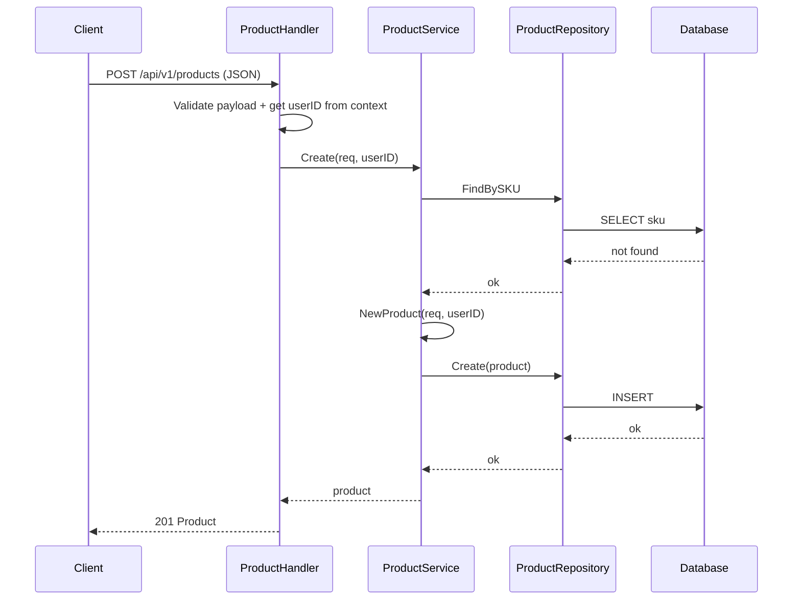
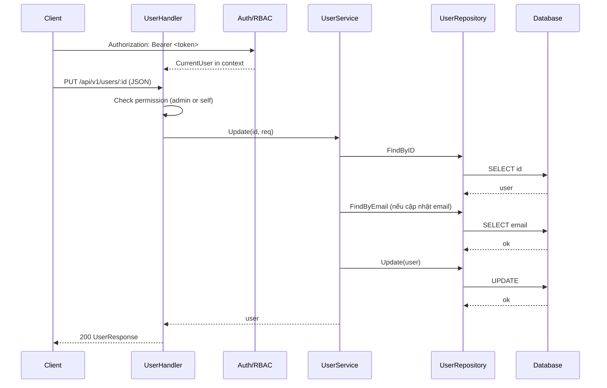

# Phase 2: CRUD User + Product

## 📋 Mục lục

1. [Tổng quan](#1-tổng-quan)
2. [Cấu trúc liên quan](#2-cấu-trúc-liên-quan)
3. [API Contracts - User CRUD](#3-api-contracts---user-crud)
4. [API Contracts - Product CRUD](#4-api-contracts---product-crud)
5. [Routing + RBAC](#5-routing--rbac)
6. [Validation, Pagination, Sorting, Searching](#6-validation-pagination-sorting-searching)
7. [Luồng xử lý điển hình](#7-luồng-xử-lý-điển-hình)
8. [Testing gợi ý](#8-testing-gợi-ý)
9. [Tóm tắt](#9-tóm-tắt)

---

## 1. Tổng quan

Giai đoạn này triển khai đầy đủ CRUD cho User và Product, tái sử dụng các thành phần JWT + RBAC ở Phase 1. Tài liệu bám sát code hiện có trong repo, bao gồm models, handlers, services, repositories, routes, và middleware.

Mục tiêu:
- Định nghĩa rõ hợp đồng API (request/response/status codes)
- Liên kết với RBAC: ai được phép gọi endpoint nào
- Mô tả validation, phân trang, lọc, tìm kiếm, sắp xếp
- Cung cấp ví dụ curl thực chiến

---

## 2. Cấu trúc liên quan

```
internal/
  app/
    handlers/
      user_handler.go       # CRUD User
      product_handler.go    # CRUD Product
    routes/
      routes.go             # Khai báo routes và middleware
    middleware/
      auth.go, rbac.go      # Authn/Authz
  domain/
    models/
      user.go               # User entity + helpers
      product.go            # Product entity + requests/responses
      auth.go               # UserCreateRequest, UserUpdateRequest, UserResponse
      common.go             # ErrorResponse, SuccessResponse, Pagination
    services/
      user_service.go       # Nghiệp vụ User
      product_service.go    # Nghiệp vụ Product
    repository/
      user_repository.go    # Truy cập dữ liệu User
      product_repository.go # Truy cập dữ liệu Product
```

Một số middleware và hàm tiện ích được dùng:
- `AuthMiddleware.Authenticate()` và `OptionalAuthenticate()`
- `middleware.RequireRole("admin")` (có sẵn từ Phase 1)
- `middleware.GetCurrentUser(c)`, `middleware.GetUserID(c)` để lấy user hiện tại

---

## 3. API Contracts - User CRUD

### 3.1. Models chính

Nguồn: `internal/domain/models/auth.go`, `internal/domain/models/user.go`

- User entity (rút gọn các trường quan trọng):
  - id (UUID), email, first_name, last_name, is_active, roles[] (dạng string khi response), created_at, updated_at
- Request/Response:
  - `UserCreateRequest`:
    - username (string, required, 3-50)
    - email (email, required)
    - password (string, required, min=6)
    - first_name, last_name, role (optional)
  - `UserUpdateRequest`:
    - email, first_name, last_name, is_active, role (all optional)
  - `UserResponse`:
    - id, email, first_name, last_name, is_active, roles[], created_at, updated_at

Lưu ý: Password không bao giờ xuất hiện trong response.

### 3.2. Endpoints và quyền truy cập

1) GET /api/v1/users/:id
- Auth: Optional (dùng `OptionalAuthenticate()`), public xem được thông tin user cơ bản
- Response: 200 UserResponse | 404 user_not_found | 400 validation_error

2) GET /api/v1/users
- Auth: Bắt buộc + Role: admin (`Authenticate()` + `RequireRole("admin")`)
- Query: page (default 1), limit (default 10, max 100)
- Response: 200 { users: UserResponse[], pagination } | 403 forbidden

3) POST /api/v1/users
- Auth: Bắt buộc + Role: admin
- Body: UserCreateRequest
- Response: 201 UserResponse | 409 email/username exists | 400 validation_error

4) PUT /api/v1/users/:id
- Auth: Bắt buộc
- Quy tắc: Admin được update bất kỳ user; user thường chỉ được update chính mình; user thường không được đổi is_active
- Body: UserUpdateRequest
- Response: 200 UserResponse | 403 forbidden | 404 user_not_found | 409 email exists

5) DELETE /api/v1/users/:id
- Auth: Bắt buộc + Role: admin
- Hành vi: soft delete
- Response: 200 SuccessResponse | 404 user_not_found

### 3.3. Ví dụ curl

Tạo user (admin):
```bash
curl -X POST http://localhost:8001/api/v1/users \
  -H "Authorization: Bearer $ADMIN_TOKEN" \
  -H "Content-Type: application/json" \
  -d '{
    "username": "johndoe",
    "email": "john@example.com",
    "password": "Passw0rd!",
    "first_name": "John",
    "last_name": "Doe"
  }'
```

Lấy user theo id (public):
```bash
curl -X GET http://localhost:8001/api/v1/users/550e8400-e29b-41d4-a716-446655440000
```

Danh sách users (admin):
```bash
curl -X GET "http://localhost:8001/api/v1/users?page=1&limit=20" \
  -H "Authorization: Bearer $ADMIN_TOKEN"
```

Update user (self hoặc admin):
```bash
curl -X PUT http://localhost:8001/api/v1/users/550e8400-e29b-41d4-a716-446655440000 \
  -H "Authorization: Bearer $TOKEN" \
  -H "Content-Type: application/json" \
  -d '{
    "first_name": "Johnny"
  }'
```

Xoá user (admin):
```bash
curl -X DELETE http://localhost:8001/api/v1/users/550e8400-e29b-41d4-a716-446655440000 \
  -H "Authorization: Bearer $ADMIN_TOKEN"
```

---

## 4. API Contracts - Product CRUD

### 4.1. Models chính

Nguồn: `internal/domain/models/product.go`

- Product entity:
  - id (string UUID), name, description, price (float), category, sku (unique), stock (int), is_active (bool), created_by (user id), created_at, updated_at
- Request/Response:
  - `ProductCreateRequest`:
    - name (required, 1-200), description, price (required, >=0), category (required), sku (required), stock (>=0)
  - `ProductUpdateRequest` (tất cả optional, pointer):
    - name, description, price (>=0), category, sku (unique), stock (>=0), is_active
  - `ProductListQuery` (query):
    - page (>=1, default 1), limit (1..100, default 10), category, search, sort_by (default created_at), sort_dir (asc|desc, default desc)
  - `ProductListResponse`:
    - products: Product[]; pagination: PaginationMetadata

### 4.2. Endpoints và quyền truy cập

1) GET /api/v1/products
- Public
- Query: page, limit, category, search, sort_by, sort_dir
- Response: 200 ProductListResponse

2) GET /api/v1/products/categories
- Public
- Response: 200 { categories: string[] }

3) GET /api/v1/products/:id
- Public
- Response: 200 Product | 404 product_not_found | 400 validation_error

4) POST /api/v1/products
- Auth: Bắt buộc
- Quy tắc: Người dùng đã đăng nhập có thể tạo sản phẩm; `created_by` = user hiện tại
- Body: ProductCreateRequest
- Response: 201 Product | 409 SKU already exists | 400 validation_error

5) PUT /api/v1/products/:id
- Auth: Bắt buộc
- Quy tắc: admin được sửa mọi sản phẩm; chủ sở hữu (created_by) được sửa sản phẩm của mình
- Body: ProductUpdateRequest
- Response: 200 Product | 403 forbidden | 404 product_not_found | 409 SKU already exists

6) DELETE /api/v1/products/:id
- Auth: Bắt buộc
- Quy tắc: admin hoặc chủ sở hữu
- Hành vi: soft delete bằng cách set `is_active=false`
- Response: 200 SuccessResponse | 403 forbidden | 404 product_not_found

7) PATCH /api/v1/products/:id/stock
- Auth: Bắt buộc
- Quy tắc: admin hoặc chủ sở hữu
- Body: { stock: int >= 0 }
- Response: 200 SuccessResponse | 403 forbidden | 404 product_not_found | 400 validation_error

### 4.3. Ví dụ curl

Tạo product:
```bash
curl -X POST http://localhost:8001/api/v1/products \
  -H "Authorization: Bearer $TOKEN" \
  -H "Content-Type: application/json" \
  -d '{
    "name": "iPhone 15 Pro",
    "description": "Latest iPhone",
    "price": 999.99,
    "category": "Electronics",
    "sku": "IP15P-128-BLK",
    "stock": 100
  }'
```

Danh sách products (lọc + tìm kiếm + phân trang):
```bash
curl -X GET "http://localhost:8001/api/v1/products?category=Electronics&search=iPhone&page=1&limit=10&sort_by=created_at&sort_dir=desc"
```

Chi tiết product:
```bash
curl -X GET http://localhost:8001/api/v1/products/550e8400-e29b-41d4-a716-446655440000
```

Update product (admin hoặc chủ sở hữu):
```bash
curl -X PUT http://localhost:8001/api/v1/products/550e8400-e29b-41d4-a716-446655440000 \
  -H "Authorization: Bearer $TOKEN" \
  -H "Content-Type: application/json" \
  -d '{
    "price": 949.00,
    "stock": 80
  }'
```

Xoá product (soft delete):
```bash
curl -X DELETE http://localhost:8001/api/v1/products/550e8400-e29b-41d4-a716-446655440000 \
  -H "Authorization: Bearer $TOKEN"
```

Cập nhật tồn kho:
```bash
curl -X PATCH http://localhost:8001/api/v1/products/550e8400-e29b-41d4-a716-446655440000/stock \
  -H "Authorization: Bearer $TOKEN" \
  -H "Content-Type: application/json" \
  -d '{ "stock": 120 }'
```

---

## 5. Routing + RBAC

Nguồn: `internal/app/routes/routes.go`

- User routes:
  - Public: `GET /api/v1/users/:id` (OptionalAuthenticate để lấy context nếu có)
  - Protected: nhóm routes dùng `Authenticate()`
    - Admin only: `GET /api/v1/users`, `POST /api/v1/users`, `DELETE /api/v1/users/:id` với `RequireRole("admin")`
    - Update profile: `PUT /api/v1/users/:id` (admin hoặc self)

- Product routes:
  - Public: `GET /api/v1/products`, `GET /api/v1/products/categories`, `GET /api/v1/products/:id`
  - Protected (đã đăng nhập): `POST /api/v1/products`, `PUT /api/v1/products/:id`, `DELETE /api/v1/products/:id`, `PATCH /api/v1/products/:id/stock`
  - RBAC trong handler: kiểm tra `admin` hoặc chủ sở hữu (`created_by`) trước khi update/delete/stock

Gợi ý mở rộng RBAC cho product (nếu muốn limit mạnh hơn):
- Thêm `RequireRole("admin")` vào POST/PUT/DELETE/PATCH khi cần chỉ admin được chỉnh sửa
- Hoặc triển khai `RequirePermission("product.create")` tương tự Phase 1

---

## 6. Validation, Pagination, Sorting, Searching

- Validation dựa trên `binding` tags trong models và `ShouldBindJSON`/`ShouldBindQuery` ở handlers.
  - UserCreateRequest: email hợp lệ, password >= 6 ký tự, username 3..50
  - ProductCreateRequest: name 1..200, price >= 0, stock >= 0, sku unique
  - ProductUpdateRequest: các trường pointer, chỉ update những gì gửi lên
- Pagination: `page` (>=1), `limit` (1..100). Trả về `PaginationMetadata` gồm page, limit, total, total_pages, has_next, has_prev.
- Searching (Product): `search` theo name/description/category/sku; (User) có `Search` trong repo (chưa lộ endpoint — có thể bổ sung sau nếu cần).
- Sorting (Product): `sort_by`, `sort_dir` trong query model; service hiện ưu tiên filter/search và phân trang thủ công cho case filter/search.

Mã lỗi thường gặp:
- 400 validation_error | invalid user/product ID
- 401 unauthorized (chưa đăng nhập)
- 403 forbidden (không đủ quyền)
- 404 user_not_found | product_not_found
- 409 email already exists | SKU already exists

---

## 7. Luồng xử lý điển hình

### 7.1. Tạo Product (đã đăng nhập)



### 7.2. Update User (self hoặc admin)



---

## 8. Testing gợi ý

Repo đã có sẵn test mẫu:
- Unit: `test/unit/*_test.go` (handlers)
- Integration: `test/integration/*_integration_test.go` (luồng end-to-end)

Gợi ý bổ sung:
- User
  - Create user: happy path, email trùng, password yếu
  - Update: self vs admin, không cho self đổi is_active
  - List: chỉ admin, pagination
  - Delete: chỉ admin
- Product
  - Create: SKU trùng, validation các field
  - Update: admin/owner, SKU trùng
  - Delete: admin/owner (soft delete is_active=false)
  - List: category/search/sort/pagination
  - Update stock: ràng buộc stock >= 0; admin/owner

---

## 9. Tóm tắt

Phase 2 hoàn thiện CRUD cho User và Product với:
- API rõ ràng, bám sát code và kiểu dữ liệu hiện có
- Áp dụng JWT Auth + RBAC để kiểm soát truy cập
- Validation, phân trang, lọc, tìm kiếm, sắp xếp
- Ví dụ curl để thử nhanh

Tiếp theo có thể mở rộng:
- Expose endpoint search User
- Thêm permission-based middleware chi tiết cho Product (`product.create`, `product.update`, …)
- Bổ sung audit log (created_by/updated_by) thống nhất cho User

Chúc bạn tiếp tục phát triển thuận lợi! 🚀
