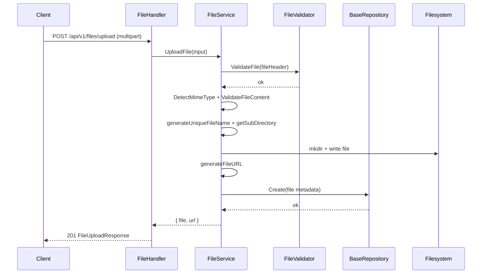
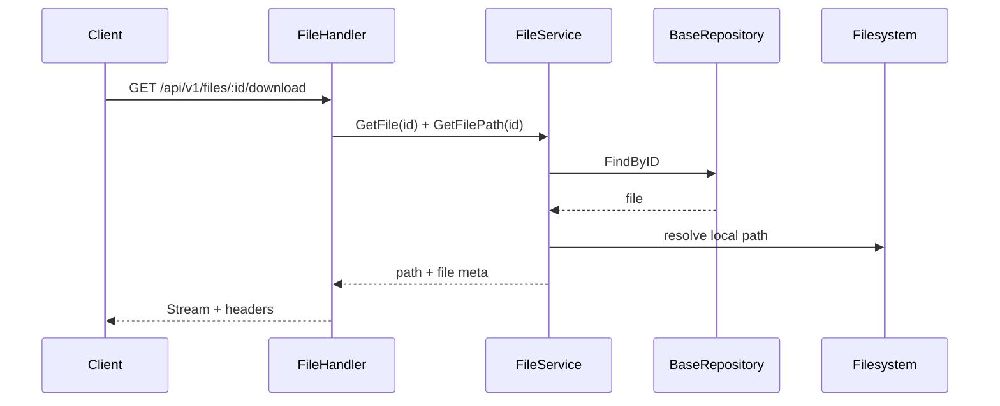

# Phase 3: Quản lý File (Upload/Download/List/Delete)

## 📋 Mục lục

1. [Tổng quan](#1-tổng-quan)
2. [Cấu trúc liên quan](#2-cấu-trúc-liên-quan)
3. [Models, DTOs và Validator](#3-models-dtos-và-validator)
4. [API Contracts](#4-api-contracts)
5. [Routing + RBAC](#5-routing--rbac)
6. [Cấu hình Storage](#6-cấu-hình-storage)
7. [Luồng hoạt động](#7-luồng-hoạt-động)
8. [Testing gợi ý](#8-testing-gợi-ý)
9. [Tóm tắt và mở rộng](#9-tóm-tắt-và-mở-rộng)

---

## 1. Tổng quan

Giai đoạn này tập trung vào quản lý file: upload 1/multiple, xem metadata, tải xuống, lấy URL, liệt kê file theo user và xóa file. Tài liệu bám sát code hiện có trong repo và phong cách của Phase 1/2.

Mục tiêu:
- Rõ ràng về hợp đồng API, kiểm soát truy cập, xử lý lỗi
- Mô tả validation (kích thước, loại file, extension), lưu trữ local theo ngày (YYYY/MM/DD)
- Ví dụ thực chiến bằng curl và trình tự xử lý

---

## 2. Cấu trúc liên quan

```
internal/
  app/
    handlers/
      file_handler.go           # HTTP handlers cho file
    routes/
      routes.go                 # Khai báo routes /files
  domain/
    models/
      file.go                   # File entity + helpers
      response.go               # FileUploadResponse, MultipleFileUploadResponse, FileListResponse, FileURLResponse
    services/
      file_service.go           # Nghiệp vụ upload, delete, get, list
    repository/
      base_repository.go        # Create, FindByID, Delete
  pkg/
    validate/
      file_validator.go         # FileValidator và các bộ validator ảnh/tài liệu/video
    config/
      storage.go                # StorageConfig (env)
```

---

## 3. Models, DTOs và Validator

### 3.1. File entity (nguồn: `internal/domain/models/file.go`)

Các trường đáng chú ý:
- `id` (UUID)
- `original_name`: tên gốc
- `file_name`: tên lưu trữ đã được sinh duy nhất
- `file_path`: đường dẫn tương đối trong thư mục uploads, có dạng `YYYY/MM/DD/<file_name>`
- `file_size`, `mime_type`, `extension`
- `storage_type`: local|s3|gcs|azure (hiện dùng local)
- `url`, `thumbnail_url`
- `uploaded_by`: user ID (nullable)
- `metadata`: dạng JSON (lưu chuỗi JSON hợp lệ hoặc null)
- `is_public`: bool
- `created_at`, `updated_at`, `deleted_at`

Helpers:
- `IsImage/IsVideo/IsDocument()`, `GetSizeInMB/KB()`

### 3.2. Response models (nguồn: `internal/domain/models/response.go`)

- `FileUploadResponse`: `{ file, url, message }`
- `MultipleFileUploadResponse`: `{ files: FileUploadResponse[], count, message }`
- `FileListResponse`: `{ files: File[], count }`
- `FileURLResponse`: `{ id, original_name, url, thumbnail_url?, is_public }`

### 3.3. FileValidator (nguồn: `internal/pkg/validate/file_validator.go`)

Các lỗi tiêu biểu: `ErrFileTooLarge`, `ErrInvalidFileType`, `ErrInvalidExtension`, `ErrEmptyFile`, `ErrInvalidFileName`.

Config chính:
- `MaxFileSize` (mặc định 10MB nếu không set)
- `AllowedMimeTypes`, `AllowedExtensions` (có sẵn preset cho ảnh/tài liệu/video)

Hàm chính:
- `ValidateFile(fileHeader)`: kích thước, tên file, extension
- `ValidateFileContent(file, mimeType)`: kiểm tra MIME theo nội dung thực tế
- `DetectMimeType(file)`: dò type theo magic bytes và reset offset

---

## 4. API Contracts

Tất cả routes dưới `/api/v1/files`.

### 4.1. Upload một file
- Method/Path: `POST /upload`
- Auth: Bắt buộc (Bearer)
- Content-Type: `multipart/form-data`
- Form fields:
  - `file`: file (bắt buộc)
  - `is_public`: bool (mặc định false)
  - `metadata`: string (nếu là JSON hợp lệ sẽ lưu nguyên; nếu không sẽ bọc thành JSON string)
- Response:
  - 201 `{ file, url, message }`
  - 400 `file_required|multipart_error|upload_failed`
  - 401 `unauthorized`
  - 413 `file size exceeds maximum allowed`

Ví dụ:
```bash
curl -X POST http://localhost:8001/api/v1/files/upload \
  -H "Authorization: Bearer $TOKEN" \
  -F "file=@/path/to/image.jpg" \
  -F "is_public=true" \
  -F 'metadata={"alt":"Cover"}'
```

### 4.2. Upload nhiều file
- Method/Path: `POST /upload/multiple`
- Auth: Bắt buộc
- Content-Type: `multipart/form-data`
- Form fields:
  - `files`: mảng file (ít nhất 1)
  - `is_public`: bool
  - `metadata`: string
- Response:
  - 201 `{ files: [...], count, message }`
  - 400 `files_required|multipart_error|upload_failed`
  - 401, 413 tương tự

Ví dụ:
```bash
curl -X POST http://localhost:8001/api/v1/files/upload/multiple \
  -H "Authorization: Bearer $TOKEN" \
  -F "files=@/path/a.png" \
  -F "files=@/path/b.pdf" \
  -F "is_public=false"
```

### 4.3. Lấy chi tiết file
- Method/Path: `GET /:id`
- Auth: Bắt buộc
- Response: 200 `File` | 404 `file_not_found` | 400 `invalid_file_id`

### 4.4. Tải xuống file
- Method/Path: `GET /:id/download`
- Auth: Bắt buộc
- Response: 200 stream (octet-stream) + headers `Content-Disposition`, `Content-Type`

### 4.5. Liệt kê file của chính user
- Method/Path: `GET /`
- Auth: Bắt buộc
- Query (hiện handler chưa phân trang, có thể mở rộng): `page`, `limit`, `type`
- Response: 200 `{ files, count }`

### 4.6. Xoá file
- Method/Path: `DELETE /:id`
- Auth: Bắt buộc
- Quy tắc: chỉ owner (uploaded_by) được xoá
- Response: 200 `SuccessResponse` | 403 `access_denied` | 404 `file_not_found`

### 4.7. Lấy URL công khai
- Method/Path: `GET /:id/url`
- Auth: Bắt buộc
- Response: 200 `FileURLResponse` | 404 `file_not_found` | 400 `invalid_file_id`

---

## 5. Routing + RBAC

Nguồn: `internal/app/routes/routes.go`

- Public:
  - `GET /files/:id` (hiện tại code routes cho file metadata/URL/download đều nằm trong nhóm yêu cầu Authenticate; nếu muốn public theo `is_public` có thể tách thêm group public.)
- Protected (yêu cầu `Authenticate()`):
  - `POST /files/upload`
  - `POST /files/upload/multiple`
  - `GET /files` (list của chính user)
  - `GET /files/:id`, `GET /files/:id/download`, `GET /files/:id/url`
  - `DELETE /files/:id` (owner check trong handler)

Owner check: Trong `DeleteFile`, so sánh `file.uploaded_by` với `current user id`, nếu khác trả 403.

Gợi ý mở rộng RBAC:
- Cho phép admin tải/xoá mọi file
- Với file `is_public=true`, cho phép `GET /:id/url` không cần auth

---

## 6. Cấu hình Storage

Nguồn: `internal/pkg/config/storage.go`, `services.NewFileService`

Biến môi trường:
- `STORAGE_PROVIDER` (mặc định `local`)
- `STORAGE_LOCAL_PATH` (mặc định `./uploads`)
- `STORAGE_MAX_FILE_SIZE` (bytes, mặc định 10485760 ~ 10MB)
- Các trường S3/GCS/Azure để mở rộng trong tương lai

Local storage trong service:
- `UploadDir`: thư mục gốc (mặc định `./uploads`)
- File sẽ lưu theo ngày: `YYYY/MM/DD/<unique-name>`
- URL sinh từ `BaseURL + /uploads/<relative>` (mặc định `http://localhost:8080`)

Phục vụ static (gợi ý):
- Đảm bảo backend hoặc reverse proxy (nginx) có route phục vụ `/uploads/*` tới thư mục `UploadDir`.

---

## 7. Luồng hoạt động

### 7.1. Upload 1 file



### 7.2. Download file



---

## 8. Testing gợi ý

Unit tests (handlers):
- UploadFile: thành công, thiếu file, file quá lớn, sai MIME/extension
- UploadMultiple: 1 file fail -> trả về lỗi ngay; validate bộ nhiều file
- GetFile: id invalid, not found, success
- DownloadFile: headers đúng, content-type khớp meta
- ListFiles: trả về list của user hiện tại
- DeleteFile: owner vs non-owner, not found
- GetFileURL: not found, success

Integration tests:
- Upload + Get + Download + Delete full flow
- Metadata JSON/non-JSON được lưu đúng (chuỗi JSON hợp lệ vs được quote)
- is_public và hành vi public URL (nếu mở rộng)

Mocking/fixture:
- Sử dụng sample nhỏ < 100KB cho speed
- Dọn dẹp temporary upload sau test

---

## 9. Tóm tắt và mở rộng

Hoàn tất quản lý file với upload, nhiều file, list, metadata, download, delete, và lấy URL, tích hợp xác thực và kiểm tra owner. 

Hướng mở rộng an toàn:
- Bật public URL cho `is_public` mà không cần auth
- Tích hợp S3/GCS/Azure theo `StorageConfig`
- Sinh thumbnail cho ảnh và lưu `thumbnail_url`
- Giới hạn loại file theo route (ví dụ endpoint upload-image chỉ nhận ảnh)
- Thêm phân trang/loc theo type cho `ListFiles`

Chúc bạn triển khai suôn sẻ! 🚀
